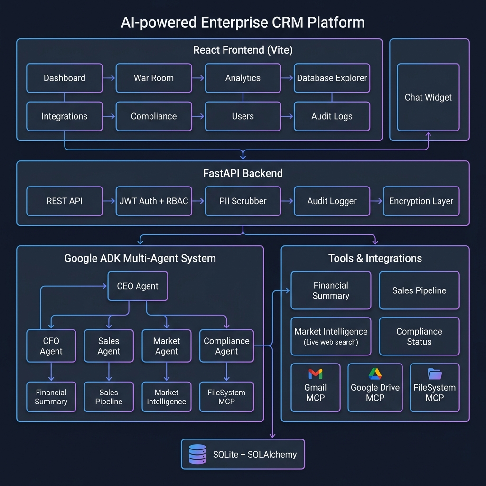

# 🚀 AI-Powered Enterprise CRM

> **A full-stack, agentic AI platform that replaces an entire C-suite with a team of autonomous AI agents — a CEO, CFO, Sales Director, Market Analyst, and Compliance Officer — all working collaboratively to run your business.**

Built with **React + Vite**, **FastAPI**, **Google ADK (Agent Development Kit)**, and **Gemini 2.5 Flash**.

---

## 📋 Table of Contents

- [Problem Statement](#-problem-statement)
- [Why Agents?](#-why-agents)
- [Solution Overview](#-solution-overview)
- [Architecture](#-architecture)
- [Agent System Design](#-agent-system-design)
- [Key Features](#-key-features)
- [Security & Compliance](#-security--compliance)
- [Tech Stack](#-tech-stack)
- [Project Structure](#-project-structure)
- [Setup & Installation](#-setup--installation)
- [Docker Deployment](#-docker-deployment)
- [Demo & Screenshots](#-demo--screenshots)
- [The Build Journey](#-the-build-journey)

---

## 🎯 Problem Statement

Modern businesses drown in operational complexity. A typical mid-market company juggles:

- **Financial dashboards** scattered across Stripe, QuickBooks, and spreadsheets.
- **CRM data** siloed in Salesforce with no real-time strategic insight.
- **Compliance audits** that are manual, error-prone, and reactive.
- **Market intelligence** that requires hours of manual research across dozens of sources.
- **Executive communication** bottlenecks — drafting board updates, investor emails, and compliance reports.

The result? **Executives spend 60% of their time gathering data instead of making decisions.** Small and mid-market companies cannot afford a full C-suite, yet they face the same strategic complexity as enterprise organizations.

**The core question:** *What if an AI system could autonomously perform the work of an entire executive team — analyzing finances, monitoring sales pipelines, researching competitors, auditing compliance, and drafting communications — all in real-time, all from a single platform?*

---

## 🤖 Why Agents?

Traditional AI chatbots are **reactive**: they answer one question at a time and cannot coordinate complex, multi-step workflows. This project demands something fundamentally different.

**Agents are the answer because:**

1.  **Specialization:** Each business domain (finance, sales, compliance, market research) requires deep, specialized reasoning. A single monolithic LLM cannot excel at all of them simultaneously. By creating **dedicated specialist agents** (CFO, Sales, Market, Compliance), each agent has focused instructions, domain-specific tools, and tailored system prompts that make it an expert in its field.

2.  **Orchestration:** Real business decisions are cross-functional. "Should we enter the European market?" requires the CFO to assess runway, the Sales Agent to evaluate pipeline capacity, the Market Agent to research competitors in Europe, and the Compliance Agent to flag GDPR risks. Our **CEO Agent** acts as a root orchestrator, delegating sub-tasks to specialists and synthesizing their findings into a unified executive-level answer — something a simple chatbot cannot do.

3.  **Tool Use & MCP Integration:** Agents don't just talk — they **act**. Our agents use real tools to read/write files (FileSystem MCP), draft emails (Gmail MCP), export reports (Google Drive MCP), execute SQL queries, and even perform **live web searches** for real-time market news via DuckDuckGo. This tool-use paradigm is what transforms a chatbot into an operational platform.

4.  **Human-in-the-Loop Safety:** Sensitive actions (sending emails, exporting to Drive) use Google ADK's `require_confirmation` mechanism, presenting the user with an approval dialog before any external action is taken. This ensures AI autonomy without sacrificing human oversight.

---

## 💡 Solution Overview

**AI-Powered Enterprise CRM** is a unified command center where a team of AI agents collaborates to run your business operations. It combines:

- A **real-time financial dashboard** with live KPIs (MRR, burn rate, runway).
- A **multi-agent AI chat** where you converse with a virtual C-suite.
- A **Strategic War Room** for generative AI debate on high-stakes business questions.
- A **natural-language SQL analytics engine** that converts English into executable database queries.
- A **compliance management system** with GDPR checklists and risk registries.
- **Enterprise-grade security** with encrypted API keys, JWT token versioning, PII scrubbing, and comprehensive audit logging.

---

## 🏗 Architecture



The platform follows a clean three-tier architecture:

### Frontend (React + Vite)
The UI is a single-page application built with React 19, Vite 8, and Tailwind CSS. It features 10+ interactive tabs (Dashboard, War Room, Analytics, Database Explorer, Integrations, Compliance, Competitors, Briefings, Users, Audit Logs) and a persistent AI Chat Widget. All API calls include JWT `Authorization` headers for zero-trust security.

### Backend (FastAPI + Python)
The FastAPI server exposes 25+ REST endpoints handling authentication, RBAC enforcement, data management, AI orchestration, and audit logging. Every request passes through a security pipeline:

```
Request → JWT Validation → Token Version Check → Role Authorization → PII Scrubbing → Handler → Audit Log
```

### AI Agent Layer (Google ADK)
The heart of the platform. Built on the **Google Agent Development Kit (ADK)**, the multi-agent system uses a hierarchical delegation pattern:

```
CEO Agent (Root Orchestrator)
├── CFO Agent        → get_financial_summary, read_report, write_document
├── Sales Agent      → get_sales_pipeline, read_report, write_document
├── Market Agent     → get_market_intelligence, fetch_market_news (live web), read_report, write_document
└── Compliance Agent → get_compliance_status, read_report, write_document

CEO also has direct access to:
├── Gmail MCP Tool      (draft_email_update) — requires human confirmation
└── Google Drive MCP Tool (export_report_to_drive) — requires human confirmation
```

---

## 🧠 Agent System Design

### The Virtual Executive Team

| Agent | Role | Specialized Tools | Key Capability |
|-------|------|-------------------|----------------|
| **CEO Agent** | Root orchestrator. Delegates tasks, synthesizes cross-functional insights, handles executive communication. | `email_tool`, `drive_tool`, `read_report`, `write_document` | Multi-agent coordination, email drafting, report generation |
| **CFO Agent** | Financial analysis. Assesses MRR, expenses, burn rate, and runway. | `get_financial_summary`, `read_report`, `write_document` | Cash flow analysis, financial alerts, runway forecasting |
| **Sales Agent** | Pipeline management. Monitors deals, win rates, and bottlenecks. | `get_sales_pipeline`, `read_report`, `write_document` | Deal risk identification, funnel metrics, conversion analysis |
| **Market Agent** | Competitive intelligence. Researches competitors, pricing, and trends. | `get_market_intelligence`, `fetch_market_news`, `read_report`, `write_document` | **Live web search** for real-time news, competitor benchmarking |
| **Compliance Agent** | Regulatory oversight. GDPR audits, risk registries, contract reviews. | `get_compliance_status`, `read_report`, `write_document` | Compliance scoring, gap analysis, risk mitigation |

### Key Agent Patterns

- **Hierarchical Delegation:** The CEO Agent uses ADK's `sub_agents` to route finance questions to the CFO, sales questions to the Sales Agent, etc. For complex queries like "Give me a full business health audit," the CEO coordinates all four agents and synthesizes a board-level report.
- **JIT Agent-Scoped Downscoping (Zero Ambient Authority):** Direct database query helper functions enforce strict JIT execution limits. Agents have access only to what they need (`get_financial_summary` requires the CFO agent context, `get_sales_pipeline` requires the Sales agent context, etc.), protecting sensitive records from unauthorized agent queries.
- **Session Convergence Evaluation (Quality Flywheel):** Every user conversation compiles multi-turn metrics at completion (total conversation turns, convergence/satisfaction success estimation, and total estimated API token cost in USD) which are logged securely to the immutable system audit trail.
- **Tool Confirmation (Human-in-the-Loop):** Email and Drive export tools use ADK's `require_confirmation` with dynamic role-based callbacks. Only Owners/Managers can trigger email drafts, and only Owners can export to Drive.
- **RBAC-Aware Agents:** Agent tool context carries the authenticated user's role. The PII scrubber masks emails, phone numbers, and credit card numbers before they reach the LLM. Role-based system directives dynamically restrict what data the AI can disclose to Employees vs. Owners.
- **Live Web Search:** The Market Agent has access to `fetch_market_news`, a tool that queries DuckDuckGo in real-time, allowing the agent to incorporate breaking news and competitor updates into its analysis.
- **Resumability:** The ADK App is configured with `ResumabilityConfig(is_resumable=True)`, allowing long-running agent sessions to persist state across multiple user interactions.

---

## ✨ Key Features

### 1. AI-Powered Chat (Multi-Agent)
Converse with the entire virtual C-suite. Ask cross-functional questions like *"Prepare a board update email with our financial health, top deals at risk, and compliance gaps"* and watch the CEO Agent delegate to specialists, synthesize findings, draft an email, and ask for your approval before sending.

### 2. Strategic War Room
A dedicated generative AI workspace for high-stakes strategic debates. Pose questions like *"Should we acquire CompetitorX?"* and the AI generates a structured multi-perspective analysis with arguments for and against, risks, and recommendations.

### 3. Natural Language SQL Analytics
Type business questions in plain English (e.g., *"Show me all deals worth over $50K in the Negotiation stage"*). The system uses Gemini to generate SQL, executes it against your live database, and can even auto-generate Chart.js visualizations of the results.

### 4. Database Explorer
A live interface for directly viewing and managing core business entities — Sales Deals, Competitors, Compliance Checklists, Regulatory Risks, and Historical Performance data. Supports adding, editing, and deleting records via dedicated modals with role-based restrictions (e.g., only Owners can modify Deals, while Employees have read-only access), and real-time persistence.

### 5. Integrations Hub
Configure and sync third-party tools (Stripe, Salesforce, Jira, Slack, HubSpot) with secure, **AES-256 encrypted** API key storage. Features a real-time MCP sync simulation with streaming server-sent events.

### 6. Executive Briefings
Auto-generated daily briefings compiled from pinned analytics charts. Users can pin SQL-generated insights to their briefing dashboard for at-a-glance executive reporting.

### 7. Compliance & Risk Management
Interactive GDPR compliance checklists, regulatory risk registries with severity ratings, and a real-time compliance score. The Compliance Agent can assess gaps and recommend mitigation protocols.

### 8. Automated Reporting
A background scheduler runs daily at 9:00 AM, triggering the AI agents to autonomously analyze the latest financial summaries and sales pipelines, generating a concise executive report (`weekly_cron_summary.md`) without any human intervention.

---

## 🔒 Security & Compliance

This platform implements **enterprise-grade, SOC 2-aligned** security controls:

| Security Layer | Implementation | Details |
|---|---|---|
| **Password Hashing** | `bcrypt` via `passlib` | All passwords are computationally salted and hashed. Plaintext passwords never touch the database. |
| **JWT Authentication** | `PyJWT` with HS256 | Stateless token-based auth with cryptographically signed payloads containing role, username, and token version. |
| **Instant Token Revocation** | `token_version` column | When an admin changes a user's role or resets their password, the user's `token_version` is incremented, immediately invalidating all active sessions. |
| **RBAC & JIT Downscoping** | Direct DB tool checks | Every database retrieval tool enforces JIT Agent-Scoped downscoping checks. If an agent attempts queries outside its designated domain (e.g. Sales querying finance), the query is immediately blocked. |
| **Dynamic Sandboxing** | Directory containment & injection scanning | File read/write tools validate that target paths resolve within `/app/reports`, preventing path traversal egress. Agent-generated content is scanned to block malicious injection attempts (`import`, `eval`, etc.). |
| **Observability (Pillar 6 & 7)** | OpenTelemetry spans | Structured span instrumentations trace execution flows down to `agent.session`, `agent.think`, `agent.tool`, and `agent.tool_response` spans for detailed tracking. |
| **Evaluation Quality Flywheel** | GenAI Satisfaction Evaluator | An automated GenAI-based judge compares the initial user message against final response to score user satisfaction (1-5 scale) and trace token costs. |
| **API Key Encryption** | AES-256 via `cryptography.fernet` | Third-party integration API keys are symmetrically encrypted before database storage. Decrypted only in memory during active syncs. |
| **PII Scrubbing** | Regex-based masking | Emails, phone numbers, and credit card numbers are automatically masked before reaching the AI model. |
| **Comprehensive Audit Logging** | Immutable event log | Tracks: logins (success/fail), user creation/deletion, role changes, password resets, AI prompts, tool approvals/rejections, and all RBAC violations. Exportable as CSV. |
| **XSS Protection** | `DOMPurify` | All AI-generated markdown is sanitized before DOM injection. |

---

## 🛠 Tech Stack

| Layer | Technology |
|---|---|
| **Frontend** | React 19, Vite 8, Tailwind CSS, Chart.js, React Router, Axios, DOMPurify, Marked |
| **Backend** | Python 3.12, FastAPI, SQLAlchemy, Uvicorn, Pydantic |
| **AI / Agents** | Google ADK (Agent Development Kit), Gemini 2.5 Flash, Google Generative AI SDK |
| **Security** | PyJWT (HS256), passlib (bcrypt), cryptography (Fernet/AES-256) |
| **Database** | SQLite (via SQLAlchemy ORM) |
| **Live Search** | DuckDuckGo Search API (for real-time market news) |
| **DevOps** | Docker (multi-stage build), Docker Compose, uv (Python package manager) |
| **Observability & Eval** | OpenTelemetry tracer, GenAI Satisfaction Judge, Google Cloud Trace, Cloud Logging |

---

## 📁 Project Structure

```
AI-Powered-Enterprise-CRM/
│
├── app/                          # Backend (FastAPI + ADK Agents)
│   ├── agent.py                  # Multi-agent orchestration (CEO, CFO, Sales, Market, Compliance)
│   ├── tools.py                  # Agent tool definitions (financial, sales, market, compliance, MCP)
│   ├── fast_api_app.py           # FastAPI server with 25+ REST endpoints
│   ├── models.py                 # SQLAlchemy ORM models (User, Deal, Competitor, etc.)
│   ├── auth.py                   # JWT authentication, bcrypt hashing, token versioning
│   ├── encryption.py             # AES-256 Fernet encryption for API keys
│   ├── database.py               # SQLAlchemy engine and session factory
│   ├── mock_data.py              # Seed data for the business database
│   ├── utils/
│   │   ├── pii.py                # PII masking (emails, phones, credit cards)
│   │   └── audit.py              # Immutable audit log system
│   ├── app_utils/
│   │   ├── telemetry.py          # OpenTelemetry + Cloud Trace configuration
│   │   └── typing.py             # Pydantic type definitions
│   ├── reports/                  # Agent-generated reports (FileSystem MCP)
│   └── outbox/                   # Agent-drafted emails and Drive exports
│
├── frontend-react/               # Frontend (React + Vite)
│   ├── src/
│   │   ├── components/
│   │   │   ├── Chat/ChatWidget.jsx       # Persistent AI chat with the virtual C-suite
│   │   │   ├── Tabs/HomeTab.jsx          # Financial dashboard with KPI cards
│   │   │   ├── Tabs/WarRoomTab.jsx       # Strategic AI debate workspace
│   │   │   ├── Tabs/AnalyticsTab.jsx     # Natural language SQL engine
│   │   │   ├── Tabs/DatabaseTab.jsx      # Live database editor
│   │   │   ├── Tabs/IntegrationsTab.jsx  # Third-party tool integrations
│   │   │   ├── Tabs/ComplianceTab.jsx    # GDPR checklists and risk registry
│   │   │   ├── Tabs/CompetitorsTab.jsx   # Competitor analysis dashboard
│   │   │   ├── Tabs/BriefingsTab.jsx     # Auto-generated executive briefings
│   │   │   ├── Tabs/UsersTab.jsx         # User management with role editing
│   │   │   ├── Tabs/AuditTab.jsx         # Security audit logs with CSV export
│   │   │   └── ...
│   │   ├── context/AppContext.jsx         # Global state (auth, role, data)
│   │   └── pages/
│   │       ├── Login.jsx                  # Authentication page
│   │       ├── ResetPassword.jsx          # First-login password reset
│   │       └── Dashboard.jsx              # Main application shell
│   └── ...
│
├── docs/                         # Documentation and diagrams
│   └── architecture_diagram.png  # System architecture diagram
├── Dockerfile                    # Multi-stage Docker build (Node + Python)
├── docker-compose.yml            # Container orchestration with persistent volumes
├── pyproject.toml                # Python dependencies (managed by uv)
└── README.md                     # This file
```

---

## ⚙️ Setup & Installation

### Prerequisites
- **Python 3.12+** and [uv](https://docs.astral.sh/uv/) (Python package manager)
- **Node.js 20+** and npm
- **Google Cloud Project** with Vertex AI enabled (for Gemini 2.5 Flash)
- Authenticated via `gcloud auth application-default login`

### 1. Clone the Repository
```bash
git clone https://github.com/PriyankaGhawghawe/AI-Powered-Enterprise-CRM.git
cd AI-Powered-Enterprise-CRM
```

### 2. Backend Setup
```bash
# Install Python dependencies
uv sync

# Start the FastAPI server (port 8080)
uv run uvicorn app.fast_api_app:app --reload --host 0.0.0.0 --port 8080
```

### 3. Frontend Setup
```bash
cd frontend-react

# Install Node dependencies
npm install

# Start the Vite dev server (port 5173, proxies API to 8080)
npm run dev
```

### 4. Access the Application
Open `http://localhost:5173` in your browser.

### Default Accounts
| Username | Password | Role |
|----------|----------|------|
| `admin` | `admin` | Owner (full access) |
| `manager` | `manager` | Manager (limited admin) |
| `employee` | `employee` | Employee (restricted) |

> ⚠️ **Note:** On first login with these default accounts, you will be prompted to reset your password.

---

## 🐳 Docker Deployment

The entire application is containerized using a **multi-stage Docker build**:

```bash
# Build and start the container
docker-compose up --build -d

# Access at http://localhost:8080
```

The `docker-compose.yml` mounts your local `business_os.db` as a persistent volume, ensuring data survives container restarts.

**Environment Variables:**
| Variable | Description | Default |
|----------|-------------|---------|
| `SECRET_KEY` | JWT signing key | `super-secret-key-for-business-os` |
| `GOOGLE_CLOUD_PROJECT` | GCP project ID | Auto-detected |

---

## 🎥 Demo & Screenshots

> 📺 **Video Demo:** [YouTube Link — Coming Soon]

### Dashboard — Financial KPIs at a Glance
The home dashboard displays real-time MRR, burn rate, cash balance, and runway calculations with interactive Chart.js visualizations.

### AI Chat — Converse with Your Virtual C-Suite
The persistent chat widget connects you to the CEO Agent, who coordinates with the CFO, Sales, Market, and Compliance agents to answer complex cross-functional questions.

### War Room — Strategic AI Debate
Pose high-stakes business questions and receive structured multi-perspective analysis with arguments, counterarguments, and risk assessments.

### Analytics — Natural Language SQL
Type a question in plain English, and the system generates and executes SQL queries against your live database, with optional auto-generated chart visualizations.

---

## 🔨 The Build Journey

This project was built iteratively, evolving from a simple agent prototype into a full-stack enterprise platform:

1. **Foundation:** Scaffolded the Google ADK agent with `agents-cli` and defined the multi-agent hierarchy (CEO → CFO, Sales, Market, Compliance) with specialized tools.

2. **Frontend Construction:** Built a comprehensive React dashboard from scratch with 10+ tabs, each serving a distinct business function — from financial KPIs to compliance checklists.

3. **AI Integration:** Wired the multi-agent system into the frontend via a streaming chat widget, implementing PII scrubbing, role-based AI directives, and human-in-the-loop tool confirmation.

4. **Security Hardening:** Conducted a full compliance audit and addressed every gap — implementing bcrypt password hashing, JWT token versioning for instant session revocation, AES-256 API key encryption, comprehensive audit logging, and zero-trust AI endpoint protection that prevents role spoofing.

5. **Containerization:** Created a multi-stage Docker build that compiles the React frontend and bundles it with the FastAPI backend into a single deployable container, orchestrated via Docker Compose with persistent database volumes.

---

## 📄 License

This project was built as part of the Google AI Agents Hackathon using the Google Agent Development Kit (ADK).

---

<p align="center">
  Built with ❤️ using <strong>Google ADK</strong>, <strong>Gemini 2.5 Flash</strong>, <strong>React</strong>, and <strong>FastAPI</strong>
</p>
